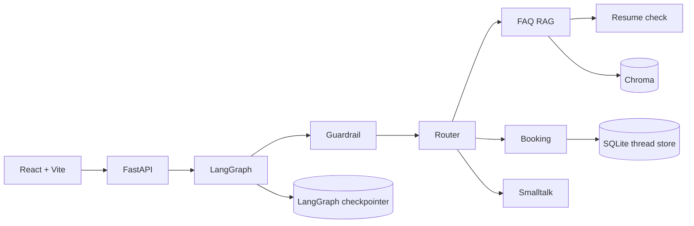

# Architecture

```mermaid
flowchart LR
  UI[React + Vite] --> API[FastAPI]
  API --> G[LangGraph]
  G --> GR[Guardrail] --> R[Router]
  R --> F[FAQ RAG] --> RC[Resume check]
  R --> B[Booking]
  R --> S[Smalltalk]
  F --> C[(Chroma)]
  B --> T[(SQLite thread store)]
  G --> CP[(LangGraph checkpointer)]
```

